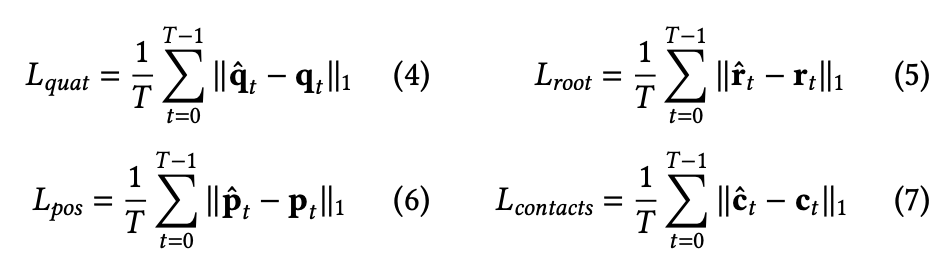

# Robust Motion In-betweening
---
Félix G. Harvey and Mike Yurick and Derek Nowrouzezahrai and Christopher Pal

---

## Goal

Generate human 3D motion between key frames

<!-- https://static-wordpress.akamaized.net/montreal.ubisoft.com/wp-content/uploads/2020/07/30140202/blanktrans2_HQ.mp4 -->
<video data-autoplay src="../assets/example.mp4"></video>

---

### Dataset - H36M/LAFan1
* LaFAN1 is a new dataset to this paper
* 496,672 motion frames sampled at 30Hz
* Actions performed by 5 subjects

---

### Dataset - H36M/LAFan1
* LaFAN1 is a new dataset to this paper
* Used a skeleton model of J=28 (H36M) and J=22 (LaFAN1)
* Represented using:
    * Quaternian vector $q_t$ of $j * 4$ dimensions encoding rotation
    * 3-dimensional global root velocity vector $r_t$
    * Contact information based on toes and feet velocities as a binary vector $c_t$ of 4-dimensions

---

### Dataset - H36M/LAFan1
* Rotate each input sequence seen by the network around the $Y$ axis (up) so that the root of the skeleton points towards the $X_+$ axis on the last frame of past context
    *  Store the applied rotation in order to rotate back the generated motion to fit the context

---

#### Architecture 
<!--  -->

--

* Up to 10 seed frames as past context 
* Target keyframe
* State encoder - Current character pose, expressed as a concatenation of the root velocity ($r_t$), joint-local quaternions ($q_t$) and feet-contact binary values ($c_t$)
* Target encoder - very similar
* Offset - Encoder Current offset from the target keyframe to the current pose, expressed as a concatenation of linear differences between root positions and orientations and between joint-local quaternions.

--

* Architecture is based on the Recurrent Transition Networks (RTN)
* Encoders are all fully-connected Feed-Forward Networks
* Original RTN architecture, resulting embeddings for each of those inputs are passed directly to an LSTM
* Two modifications

---

<!--  -->

--

* $Z_{tta}$: Time-to-arrival embedding represents the number of frames left to generate before reaching the target keyframe
* $Z_{target}$: Scheduled target noise, scaled by a scalar $\lambda_{target}$, linearly decreases during the transition and reaches zero five frames before the target

---

## Losses

* **Reconstruction Loss:** Angular Quaternion Loss is computed on the root and joint-local quaternions. Position Loss computed on the global position of each joint. Foot Contact Loss.

---

* **Adversarial Loss:** Trained two additional feed-forward discriminator networks, long-term - over 10 frames, short-term - over 2 frames
​

---

### Evaluation - H36M

* Normalized Power Spectrum Similarity (NPSS) [Gopalakrishnan et al, 2019]
    * Correlated to human assessment of quality
for motion
*  Model is similar to the one earlier, with only quaternions velocities as input

---

### Evaluation - H36M Walking-only

* L2 distances of global quaternions (L2Q) and global positions (L2P)

---

### Evaluation - LaFAN1
* Compare a reconstruction-based, future-conditioned Transition Generator ($TG_{rec}$) using $L_{quat}$, $L_{root}$, $L_{pos}$ and $L_{contact}$
* With augmented adversarial Transition Generator ($TG_{complete}$) that adds proposed embedding modifiers $z_{tta}$, $z_{tta}$ and our adversarial loss $L_{gen}$

---

## Visual Results
<iframe width="560" height="315" src="https://www.youtube.com/embed/fTV7sXqO6ig" frameborder="0" allow="accelerometer; autoplay; clipboard-write; encrypted-media; gyroscope; picture-in-picture" allowfullscreen></iframe>